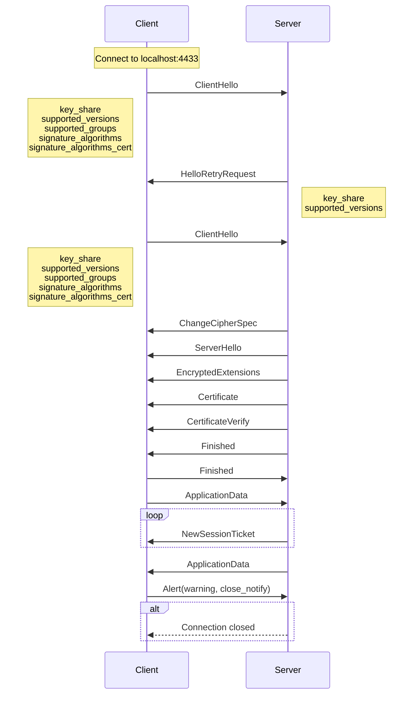

# tfviz

tfviz is a script to visualize tlsfuzzer test scripts as a sequence
diagram in the [Mermaid](https://mermaid.js.org/) format.

## Usage

```console
$ git clone --depth=1 https://github.com/tlsfuzzer/tlsfuzzer.git
$ git clone --depth=1 https://github.com/tlsfuzzer/tlslite-ng.git
$ PYTHONPATH=.:tlsfuzzer:tlslite-ng python visualize.py <tlsfuzzer-script-path> <probe-name>
```

## Example

```console
$ python visualize.py -o out.mermaid tlsfuzzer/scripts/test-tls13-obsolete-curves.py "sanity - HRR support"
```



## License

GPL2-or-later

---

*Co-authored by Claude*
